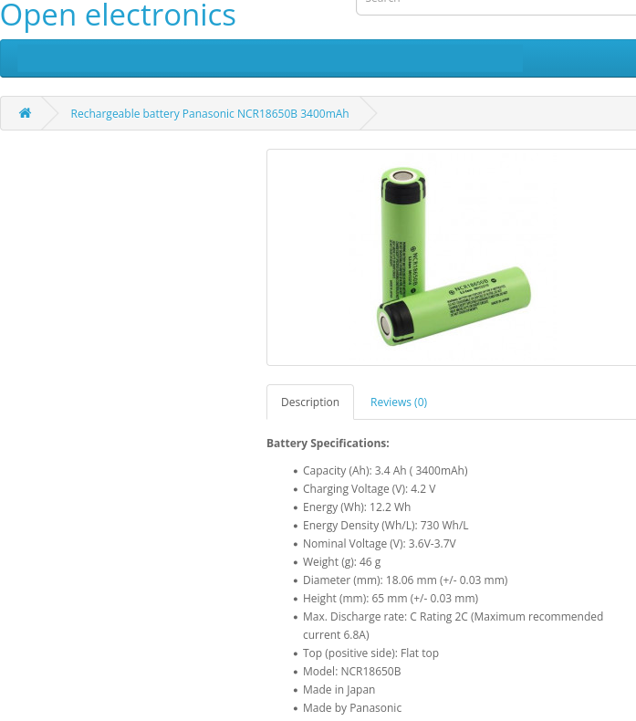

## Overview - Componentes
### Sensores:
- MAX30001
- MLX90614
- GSR
- MAX30100
- MPU6050  \text{Wh}

### Base:
- ESP32-Mini

### Bateria:
- Panasonic NCR18650B 3400mah

---
## Premissas Técnicas

| Componente / Parâmetro              | Propriedade                     | Valor                                       |
| :------------------------------------| :--------------------------------| :--------------------------------------------|
| **ESP-32 – Comunicação Wi-Fi**      | Tensão de operação              | 3,3 V                                       |
|                                     | Corrente média Wi-Fi ativa      | 160 mA                                      |
|                                     | Corrente em idle                | 50 mA                                       |
|                                     | Percentual de tempo Wi-Fi ativo | 40%                                         |
|                                     | Tempo de operação               | 24 horas                                    |
|                                     | *Nota de transmissão*           | Envio frequente para a nuvem a cada medição |
| **Wearables** *(Valores unitários)* | Quantidade total                | 5 unidades                                  |
|                                     | Tensão de operação              | 3,7 V                                       |
|                                     | Corrente média                  | 20 mA                                       |
|                                     | Operação                        | Contínua                                    |

---
## Parâmetros básicos e bateria

Bateria Panasonic NCR18650B:  
- capacidade nominal \\(C = 3{,}4\ \text{Ah} = 3400\ \text{mAh}\\)  
- tensão nominal \\(V_{\text{bat}} \approx 3{,}6\text{–}3{,}7\ \text{V}\\).  
- A energia nominal é então \\(\approx 12{,}2\ \text{Wh}\\) 
> \\(E_{\text{nom}} = V_{\text{bat}} \cdot C \approx 3{,}6 \cdot 3{,}4 \approx 12{,}2\ \text{Wh}\\), em linha com a ficha que indica \\(12{,}2\ \text{Wh}\\).

[openelectronics](https://www.openelectronics.eu/Akumuliatorius-Panasonic-NCR18650B-3400mAh)

Para "_capacidade útil_" vamos assumir 90% de uso (margem para profundidade de descarga e perdas de conversão), dando \\(E_{\text{útil}} \approx 0{,}9 \cdot 12{,}2 \approx 11{,}0\ \text{Wh}\\).

---

## Potência média dos dispositivos (kW)

### ESP32‑Mini

- Dados: \\(V_{\text{ESP}} = 3{,}3\ \text{V}\\) 
- Wi‑Fi: \\(I_{\text{wifi}} = 160\ \text{mA} = 0{,}160\ \text{A}\\) 
- idle: \\(I_{\text{idle}} = 50\ \text{mA} = 0{,}050\ \text{A}\\) 
- tempo com Wi‑Fi ativo: 40 %, idle 60 %.

Potência instantânea em cada modo (lei básica \\(P = V \cdot I\\)):

\\[
P_{\text{wifi}} = 3{,}3 \cdot 0{,}160 = 0{,}528\ \text{W}
\\]

\\[
P_{\text{idle}} = 3{,}3 \cdot 0{,}050 = 0{,}165\ \text{W}
\\]

Potência média ponderada pelos tempos:

\\[
P_{\text{wifi,med}} = 0{,}4 \cdot 0{,}528 = 0{,}2112\ \text{W}
\\]

\\[
P_{\text{idle,med}} = 0{,}6 \cdot 0{,}165 = 0{,}099\ \text{W}
\\]

\\[
P_{\text{ESP,med}} = P_{\text{wifi,med}} + P_{\text{idle,med}} \approx 0{,}3102\ \text{W}
\\]

Em kW:

\\[
P_{\text{ESP,med}} \approx 0{,}0003102\ \text{kW}
\\]

### Cada wearable

Cada wearable opera a \\(V_{\text{wear}} = 3{,}7\ \text{V}\\) e \\(I_{\text{wear}} = 20\ \text{mA} = 0{,}020\ \text{A}\\), 100 % do tempo.

\\[
P_{\text{wear}} = 3{,}7 \cdot 0{,}020 = 0{,}074\ \text{W} = 0{,}000074\ \text{kW}
\\]

### Total do sistema por paciente

Um paciente: \\(1\\) ESP32 + \\(5\\) wearables.

\\[
P_{\text{5wear}} = 5 \cdot 0{,}074 = 0{,}37\ \text{W}
\\]
\\[
P_{\text{total}} = P_{\text{ESP,med}} + P_{\text{5wear}} \approx 0{,}3102 + 0{,}37 = 0{,}6802\ \text{W}
\\]
\\[
P_{\text{total}} \approx 0{,}0006802\ \text{kW}
\\]

Para 1 000 pacientes simultâneos:
\\[
P_{\text{1000}} = 1000 \cdot 0{,}6802 \approx 680{,}2\ \text{W} \approx 0{,}6802\ \text{kW}
\\]

***

## Energia consumida (kWh) – por dia, mês e ano

Usando \\(E = P \cdot t\\), com \\(P\\) em kW e \\(t\\) em horas, a energia sai em kWh.

### ESP32‑Mini

Potência média: \\(P_{\text{ESP,med}} \approx 0{,}0003102\ \text{kW}\\).

- Dia (\\(t = 24\ \text{h}\\)):
  \\[
  E_{\text{ESP,dia}} = 0{,}0003102 \cdot 24 \approx 0{,}00744\ \text{kWh/dia}
  \\]
- Mês (30 dias):
  \\[
  E_{\text{ESP,mês}} \approx 0{,}00744 \cdot 30 \approx 0{,}223\ \text{kWh/mês}
  \\]
- Ano (365 dias):
  \\[
  E_{\text{ESP,ano}} \approx 0{,}00744 \cdot 365 \approx 2{,}72\ \text{kWh/ano}
  \\]

### Cada wearable

Potência: \\(P_{\text{wear}} = 0{,}000074\ \text{kW}\\).

- Dia:
  \\[
  E_{\text{wear,dia}} = 0{,}000074 \cdot 24 \approx 0{,}00178\ \text{kWh/dia}
  \\]
- Mês (30 dias):
  \\[
  E_{\text{wear,mês}} \approx 0{,}00178 \cdot 30 \approx 0{,}0533\ \text{kWh/mês}
  \\]
- Ano (365 dias):
  \\[
  E_{\text{wear,ano}} \approx 0{,}00178 \cdot 365 \approx 0{,}65\ \text{kWh/ano}
  \\]

### Total por paciente (1 ESP32 + 5 wearables)

- Dia:
  \\[
  E_{\text{pac,dia}} = E_{\text{ESP,dia}} + 5 \cdot E_{\text{wear,dia}}
  \approx 0{,}00744 + 5 \cdot 0{,}00178 \approx 0{,}0163\ \text{kWh/dia}
  \\]
- Mês:
  \\[
  E_{\text{pac,mês}} \approx 0{,}223 + 5 \cdot 0{,}0533 \approx 0{,}49\ \text{kWh/mês}
  \\]
- Ano:
  \\[
  E_{\text{pac,ano}} = E_{\text{ESP,ano}} + 5 \cdot E_{\text{wear,ano}}
  \approx 2{,}72 + 5 \cdot 0{,}65 \approx 29{,}8\ \text{kWh/ano}
  \\]

### Total para 5 pacientes (5 Wearables)

Multiplicamos por 5.

- Dia:
  \\[
  E_{\text{5,dia}} = 5 \cdot 0{,}0163 \approx 0{,}0815\ \text{kWh/dia}
  \\]
- Mês:
  \\[
  E_{\text{5,mês}} \approx 5 \cdot 0{,}49 \approx 2{,}45\ \text{kWh/mês}
  \\]
- Ano:
  \\[
  E_{\text{5,ano}} \approx 5 \cdot 29{,}8 \approx 149\ \text{kWh/ano}
  \\]

### Total para 1 000 pacientes (5 Wearables)

Multiplicamos por 1 000.  

- Dia:  
  \\[
  E_{\text{1000,dia}} = 1000 \cdot 0{,}0163 \approx 16{,}3\ \text{kWh/dia}
  \\]  
- Mês:  
  \\[
  E_{\text{1000,mês}} \approx 1000 \cdot 0{,}49 \approx 490\ \text{kWh/mês}
  \\]  
- Ano:  
  \\[
  E_{\text{1000,ano}} \approx 1000 \cdot 5{,}96 \approx 5{,}96\ \text{MWh/ano}
  \\]

***
